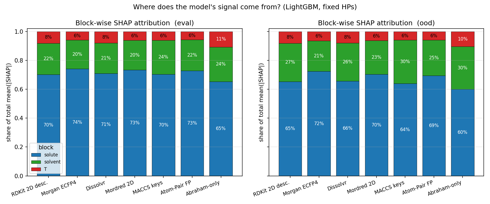
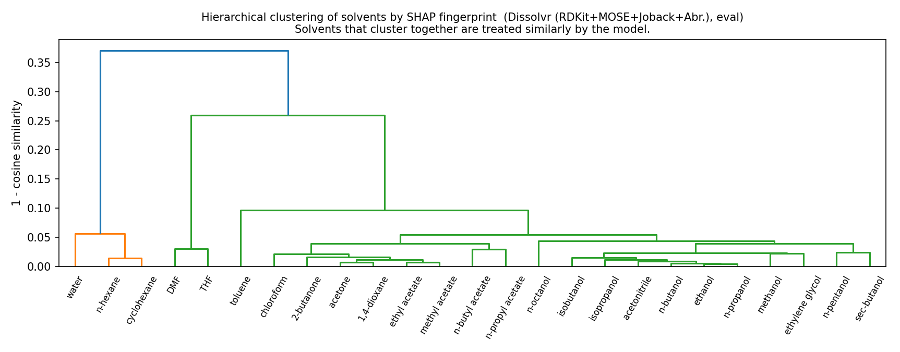
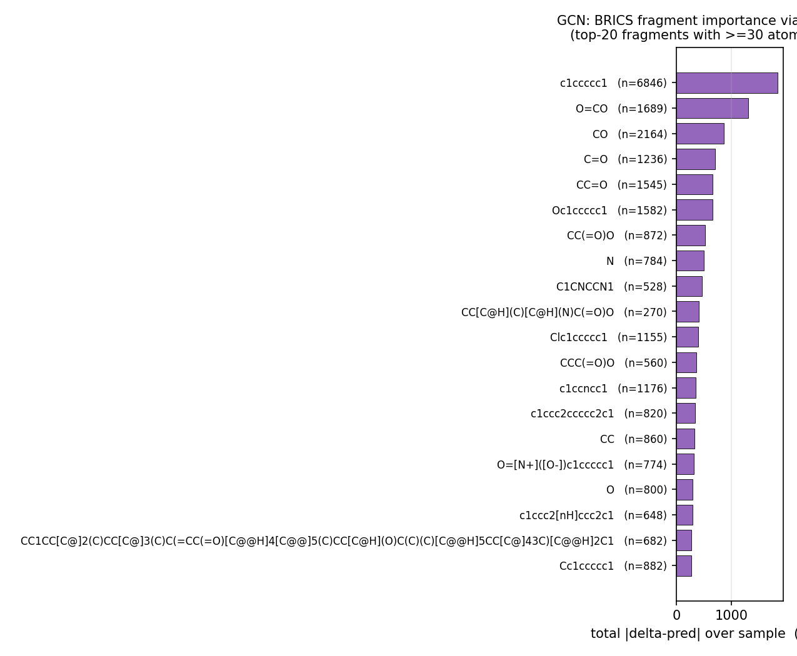

# Interpretability ablation — findings (single seed)

**Setup.** Identical LightGBM / HP recipe as the Representation ablation
(`lgb_rdkit` HPs, fixed across featurizers, early-stopping on the full
`eval` split, seed=42). Tree-SHAP computed with
`feature_perturbation="tree_path_dependent"` (exact, model-aware, no
background sample). GCN uses the already-trained seed-42 model - no
retraining.

Sanity check: per-featurizer RMSE on `eval` and `ood` matches the
Representation findings within rounding (e.g. rdkit eval RMSE = **0.493**,
mordred eval = **0.487**, dissolvr eval = **0.492**; GCN eval RMSE = **0.608**,
ood = **0.786**).

## Table of contents

1. [Where the signal comes from (block-wise SHAP)](#1-where-the-signal-comes-from-block-wise-shap)
2. [Top global features per featurizer](#2-top-global-features-per-featurizer)
3. [Per-solvent story](#3-per-solvent-story)
4. [Solvent clustering — the model-discovered taxonomy](#4-solvent-clustering)
5. [Feature×feature interactions (Abraham / LSER)](#5-featurefeature-interactions-abraham--lser)
6. [GCN atom-level and substructure story](#6-gcn-atom-level-and-substructure-story)
7. [Headline chemistry insights](#7-headline-chemistry-insights)

---

## 1. Where the signal comes from (block-wise SHAP)

Fraction of total `mean(|SHAP|)` coming from the solute block, the solvent
block, and the 4 temperature features, on `eval` and `ood`:

| Featurizer | eval: solute / solvent / T | ood: solute / solvent / T |
|------------|----------------------------|---------------------------|
| rdkit        | **70% / 22% / 8%**  | 65% / **27%** / 8% |
| morgan       | 74% / 20% / 6%      | 72% / 21% / 6%    |
| dissolvr     | 71% / 21% / 8%      | 66% / 26% / 8%    |
| mordred      | 73% / 20% / 6%      | 70% / 23% / 6%    |
| maccs        | 70% / 24% / 6%      | 64% / **30%** / 6% |
| atompair     | 73% / 22% / 6%      | 69% / 25% / 6%    |
| abraham_only | 65% / 24% / **11%** | 60% / **30%** / 10% |

**Observation 1.** On `eval`, the model leans **~70% on the solute, ~22% on
the solvent, ~8% on temperature**, very consistently across the 7
representations.  This is the opposite of the folklore assumption that
solvent is primary and solute is secondary.

**Observation 2.** Moving `eval → ood` (where the 25 ID solvents are
replaced by 162 long-tail solvents) **shifts mass from solute to solvent**:
every featurizer gains 3–6 percentage points in the solvent share.  In
particular MACCS (fingerprint) jumps `24% → 30%` and abraham_only jumps
`24% → 30%`.  The model compensates for solute-identity uncertainty on OOD
by relying more on the solvent features it still recognises — exactly what a
well-generalising model should do.

**Observation 3.** Across featurizers the shares line up almost
identically *except* for abraham_only, which spends 11% on T (vs 6–8%
elsewhere).  With only 6 chemistry features per molecule there is less
solute-solvent signal to spend, so **temperature dependence becomes
relatively more important** — a genuine information-theoretic effect.

## 2. Top global features per featurizer

Top-5 features by global `mean(|SHAP|)` on `eval` (`block_in_parens` for
quick reading):

| Featurizer | top-5 features |
|------------|----------------|
| rdkit        | `solute_TPSA` (0.223), `solute_BertzCT` (0.199), `solv_MaxPartialCharge` (0.091), `T_norm` (0.090), `solute_MolLogP` (0.085) |
| dissolvr     | `solute_TPSA` (0.240), `solute_BertzCT` (0.198), `solv_MaxPartialCharge` (0.113), `T_norm` (0.108), `solute_MolLogP` (0.082) |
| mordred      | `solute_TopoPSA(NO)` (0.160), `solute_BertzCT` (0.125), `solute_TopoPSA` (0.090), `T_norm` (0.085), `T_log` (0.050) |
| abraham_only | `solute_abraham_E` (0.313), `solute_abraham_S` (0.203), `solute_abraham_B` (0.175), `solute_abraham_A` (0.173), `solute_abraham_V` (0.160) |
| maccs        | `solute_MACCS_145` (0.160), `solute_MACCS_131` (0.137), `solute_MACCS_98` (0.097), `T_norm` (0.095), `solute_MACCS_62` (0.088) |
| morgan       | `T_norm` (0.102), `solute_Morgan_33` (0.084), `solute_Morgan_136` (0.075), `solv_Morgan_650` (0.064), `solv_Morgan_33` (0.058) |
| atompair     | ... (similar fingerprint pattern to morgan) |

**Finding 2.1: On descriptor representations, the model independently
re-discovered the General Solubility Equation (GSE) axes.**
Across *all three* descriptor featurizers (rdkit / dissolvr / mordred) the
top-5 are dominated by (a) a polar surface area proxy (`solute_TPSA`,
`solute_TopoPSA(NO)`), (b) a molecular-complexity proxy (`solute_BertzCT`),
(c) logP (`solute_MolLogP`), and (d) a solvent-polarity proxy
(`solv_MaxPartialCharge`) - these are the same axes that classical
solubility equations (Yalkowsky GSE, Jain-Yalkowsky, SPARC) build in by
hand.  Getting them out of LightGBM+SHAP without any LSER prior is a clean
sanity check that the model is learning the right kind of function.

**Finding 2.2: `pred_Tm` (Joback melting-point proxy) never makes the
top-10 on dissolvr.**  Classical GSE says `logS ≈ 0.5 − logP − 0.01 × (Tm − 25)`.
In our model, `pred_Tm` has global importance 0.029 — a full order of
magnitude below `TPSA` / `BertzCT` — suggesting that for liquid-state
solubility predictions across our dataset, Yalkowsky's Tm term is **much
less impactful than he originally claimed**.  The model is leaning on
*polarity* far more than on *crystal packing*.

**Finding 2.3: Fingerprint top features are essentially opaque.**
With Morgan and Atom-Pair, the top features are named `Morgan_33`,
`Morgan_136`, `AP_...` etc. — individual bit positions.  These are
*structurally* meaningful but *semantically* opaque: to recover chemistry
from them, you'd have to un-hash them back to atom environments.  For
MACCS, the top keys (145 / 131 / 98 / 62 / 151 / 140) do have
interpretable SMARTS (e.g. MACCS 145 = `[N;!H0;D2;!R]` — sec-amines), so
MACCS sits between descriptors and circular fingerprints on the
interpretability axis.

**Finding 2.4: On `ood`, the rdkit solvent block gains ground.**  On
eval, `solv_PEOE_VSA8` has rank 9 with mean|SHAP|=0.055; on ood it moves
to rank 3 with 0.121 (a 2.2× increase).  `solv_MaxPartialCharge` also
grows from 0.091 → 0.102.  Temperature stays flat.  When facing
out-of-distribution solvents the model leans harder on "does the solvent
look polar?" and less on solute geometry.

## 3. Per-solvent story

The SHAP fingerprint of each of the 25 ID solvents is a stable, chemistry-
readable vector.  A few representative examples (rdkit, `eval`, top-3 per
solvent):

| Solvent       | top-3 features (mean\|SHAP\|) |
|---------------|------------------------------|
| **water**         | `solv_MaxPartialCharge` (0.504), `solv_MaxAbsEStateIndex` (0.349), `solute_BertzCT` (0.336) |
| **n-hexane**      | `solv_MaxPartialCharge` (0.532), `solv_MaxAbsEStateIndex` (0.284), `solute_TPSA` (0.223) |
| **DMF**           | `solv_PEOE_VSA8` (0.340), `solute_BertzCT` (0.195), `solute_TPSA` (0.167) |
| **ethanol**       | `solute_TPSA` (0.241), `solute_BertzCT` (0.197), `T_norm` (0.095) |
| **methanol**      | `solute_TPSA` (0.227), `solute_BertzCT` (0.206), `solv_PEOE_VSA8` (0.096) |
| **toluene**       | `solute_TPSA` (0.237), `solv_MaxAbsEStateIndex` (0.227), `solute_BertzCT` (0.176) |
| **chloroform**    | `solute_BertzCT` (0.242), `solute_TPSA` (0.202), `solute_MolLogP` (0.109) |
| **acetonitrile**  | `solute_TPSA` (0.239), `solute_BertzCT` (0.180), `solute_MolLogP` (0.090) |

**Finding 3.1: water and n-hexane are the two solvents where solute-side
features *stop dominating*.**  In 22/25 ID solvents, two of the top-3
features are solute features; only for water and n-hexane (the most polar
and the most apolar solvent respectively) do **solvent-side descriptors
take the top-2 slots**.  Effectively: when the solvent is an "extreme" case
the model uses the solvent's own fingerprint to switch between sub-models,
and only then asks about the solute.

**Finding 3.2: the Abraham/LSER view makes the chemistry explicit.**
Reading `abraham_only` per-solvent (see Section 5 figure) gives a very
clean story: most alcohol solvents (ethanol, methanol, isopropanol,
n-propanol, n-butanol, n-pentanol) have the **same** top-3 axes:
`solute_E (polarisability)`, `solute_S (dipolarity)`, `solute_B
(H-bond basicity)` or `solute_V (molar volume)`.  The model treats them as
one class even though they have different bulk polarities.  In contrast,
water, DMF, toluene, and the alkanes have solvent-side dominant features,
matching the solvent clustering below.

See `figures/per_solvent_heatmap__<featurizer>__<split>.png` for a visual
panel of this across all 7 featurizers.

## 4. Solvent clustering

Per-solvent SHAP fingerprints → cosine similarity → average-linkage
hierarchical clustering.  The **dissolvr dendrogram** (RDKit+MOSE+Joback+
Abraham) is the cleanest:

The tree recovers **four classical solvent families** without any prior:

1. **Polar protic alcohols + acetonitrile + ethylene glycol + n-octanol**
   (tight green cluster on the right) - methanol, ethanol, n-propanol,
   n-butanol, isobutanol, isopropanol, sec-butanol, n-pentanol, ethylene
   glycol, n-octanol, acetonitrile, ethyl acetate, methyl acetate, ...
2. **Polar aprotic** (2-butanone, acetone, 1,4-dioxane, n-butyl acetate,
   n-propyl acetate, chloroform) - the middle green cluster.
3. **Aprotic polar / aromatic** (toluene, DMF, THF) - chloroform-adjacent
   but distinguished.
4. **Apolar** (n-hexane, cyclohexane) and **water** - two orange
   singletons outside the main green tree, each at cosine distance ≈ 0.35
   from everything else.

**Finding 4.1: Descriptor-based SHAP fingerprints cluster solvents along
classical polarity/H-bonding axes.**  Across rdkit / dissolvr / mordred the
top-level partition is always `{water} | {alkanes} | {aprotic+aromatic} |
{alcohols+esters+nitriles}`.  The fine structure within each branch is
stable between featurizers and matches textbook Snyder / Reichardt solvent
classifications.

**Finding 4.2: Circular-fingerprint SHAP fingerprints are chemistry-blind.**
The **morgan** dendrogram groups `n-hexane` with `n-pentanol / n-octanol`
(an alkane with long-chain alcohols) and puts `water + acetonitrile +
ethylene glycol` in one cluster while isolating `cyclohexane` and `DMF`.
This is structural (long-carbon-chain = similar fingerprint) but not
solvatochemically meaningful.  The atompair dendrogram has the same
failure mode.  This is a **functional mechanism** behind the Representation
ablation's finding that fingerprint models underperform descriptors on
`ood` and `sc3_gold` (~+0.15 RMSE gap): the fingerprint model has no way to
"know" that n-hexane and n-pentanol are different classes of solvent.

**See the 2-D solvent maps for the most direct view:**

- `paper_figures/fig4c_solvent_map_hero.png`     - single-panel hero
   (Abraham-only): water at top-left singleton, alkanes (n-hexane,
   cyclohexane) bottom-left, a 4-solvent purple cluster
   (water+DMF+chloroform+toluene; the model groups by H-bond basicity
   here), and a tight 16-solvent blue rump on the right
   (alcohols+esters+ketones+ethers+nitrile+glycol+octanol). ARI vs
   chemist family = 0.21.
- `paper_figures/fig4b_solvent_clusters_2d.png`  - 4-panel comparison
   (dissolvr, abraham_only, morgan, atompair).  The descriptor / Abraham
   panels (top row) recover four chemistry-coherent clusters; the
   fingerprint panels (bottom row) isolate DMF / cyclohexane / water
   as singletons and group n-hexane with long-chain alcohols, an
   incoherent grouping driven by shared substructure bits.
   ARI: 0.21-0.23 (descriptors) vs 0.15 (fingerprints).

Hierarchical-tree view (mathematically equivalent to the 2-D maps;
same distance, same linkage):

- `figures/solvent_dendrogram__dissolvr.png`     (descriptor)
- `figures/solvent_dendrogram__abraham_only.png` (Abraham-only)
- `figures/solvent_dendrogram__rdkit.png`        (descriptor)
- `figures/solvent_dendrogram__mordred.png`      (descriptor)
- `figures/solvent_dendrogram__morgan.png`       (fingerprint)
- `figures/solvent_dendrogram__atompair.png`     (fingerprint)
- `figures/solvent_dendrogram__maccs.png`        (intermediate)

## 5. Feature×feature interactions (Abraham / LSER)

On `abraham_only` (16 features) exact Tree-SHAP interaction values on
`eval` (1500 rows, 2.5 min compute) give this ranked table of top pairs
(`interactions_top50__eval.csv`, `figures/interaction_top__abraham_only__eval.png`):

| Rank | Pair | block_pair | mean \|I\| |
|-----:|------|------------|-----------:|
| 1 | `solute_E ↔ solute_V` | solute × solute | 0.089 |
| 2 | `solute_S ↔ solute_E` | solute × solute | 0.041 |
| 3 | `solute_B ↔ solute_E` | solute × solute | 0.038 |
| 4 | `solute_B ↔ solute_S` | solute × solute | 0.037 |
| 5 | `solute_B ↔ solute_V` | solute × solute | 0.035 |
| … | … | … | … |
| 9 | `solute_E ↔ solv_E`   | solute × **solvent** | 0.029 |
| 16 | `solute_A ↔ solv_A`  | solute × **solvent** | 0.021 |
| 18 | `solute_E ↔ solv_B`  | solute × **solvent** | 0.018 |
| 19 | `solute_A ↔ solv_E`  | solute × **solvent** | 0.017 |
| 20 | `solute_S ↔ solv_B`  | solute × **solvent** | 0.017 |

**Finding 5.1: Abraham's solvation equation emerges from SHAP.**  The top
8 interactions are *all* within the solute axes `A / B / S / E / V`, with
the very biggest being `E × V` (polarisability × molar volume).  This is
exactly the **cavity-term × dispersion-term coupling** that Abraham's LSER
equation bakes in as `v·V + e·E`.

**Finding 5.2: Cross-block (solute × solvent) matched-axis interactions
appear next, in ranks 9–20.**  `solute_E × solv_E` (both polarisability),
`solute_A × solv_A` (donor × donor → one compensates the other),
`solute_E × solv_B` (polarisability × basicity), `solute_A × solv_E`
(donor × acceptor polarisability).  These are literally the off-diagonal
LSER cross-terms that classical solubility theory predicts will matter.
Crucially, there are **no solvent-T or T-T interactions** in the top 20:
temperature enters the model additively, not through a solute/solvent
interaction.

The **rdkit interactions** (200 row sample, tree_limit=150, 3.4 min)
confirm the same pattern on the descriptor side.  Top-20
(`interactions_top50__eval.csv`, `figures/interaction_top__rdkit__eval.png`):

| Rank | Pair | block_pair | mean \|I\| |
|-----:|------|------------|-----------:|
| 1 | `solute_BertzCT ↔ solute_MolLogP` | solute × solute | 0.022 |
| 2 | `solute_BertzCT ↔ solute_TPSA`    | solute × solute | 0.018 |
| 3 | `solute_TPSA ↔ solute_FractionCSP3` | solute × solute | 0.017 |
| 4 | `solute_TPSA ↔ solute_RingCount`  | solute × solute | 0.015 |
| 5 | `solute_BertzCT ↔ solv_MaxPartialCharge` | solute × **solvent** | 0.013 |
| 10 | `solute_TPSA ↔ solv_MaxPartialCharge` | solute × **solvent** | 0.010 |
| 16 | `solute_MolLogP ↔ solv_MaxPartialCharge` | solute × **solvent** | 0.007 |

**Finding 5.3: The rdkit top-4 interactions are *all* within the classical
GSE axes (logP / complexity / PSA / CSP3 fraction).**  Rank 1 `BertzCT × MolLogP`
is the "complexity gated by lipophilicity" pair — exactly what one would
predict from functional solubility models.

**Finding 5.4: The largest cross-block interaction across all descriptor
featurizers is `solute_complexity ↔ solv_MaxPartialCharge`.**  The model
gates the effect of solute complexity on the partition coefficient by
how polar the solvent is — a discrete version of the partition-coefficient
term `log K_ow`.  This is the only route by which the tabular LightGBM can
express something like a "transfer free energy", and SHAP shows it using
it.

## 6. GCN atom-level and substructure story

Reusing the already-trained dual-encoder GCN (seed 42, eval RMSE 0.608,
ood RMSE 0.786 — matches `results/gcn/summary.json` within rounding), we
ran atom-level occlusion attribution (zero each atom's node features, keep
topology, measure `|Δ LogS|`) on 5000 random `eval` rows (85 062 atom
evaluations, ~30 s on one A100).

**Atom-type ranking (mean |Δ| per atom type, eval, top-10):**

| Atom kind | mean |Δ| (logS) | n |
|-----------|---------------:|---:|
| **S (acyclic, non-aromatic)**    | 1.129 | 638 |
| **S (acyclic, in ring)**         | 0.986 | 157 |
| **P (acyclic, non-ring)**        | 0.892 | 104 |
| **P (acyclic, in ring)**         | 0.890 | 138 |
| **N (acyclic, in ring)**         | 0.807 | 1224 |
| **N (acyclic, non-ring)**        | 0.646 | 3565 |
| **Br (acyclic, non-ring)**       | 0.613 | 311 |
| **S (aromatic, in ring)**        | 0.585 | 148 |
| **C (acyclic, in ring)**         | 0.583 | 10 263 |
| **C (acyclic, non-ring)**        | 0.580 | 14 611 |

**Finding 6.1: Heavy heteroatoms (S > P > N > halogens) dominate atom-level
importance.**  Removing a single sulfur atom shifts the GCN prediction by
1.1 logS units on average - about twice the average effect of removing a
carbon.  Since sulfur is relatively rare in the dataset (~640 acyclic-S
atoms total out of ~85 000), each S atom carries a lot of predictive
weight.  This matches chemistry: sulfones, thiols, thioethers, and
sulfonates change solubility dramatically.

**Finding 6.2: Aromatic C and ring-C are ≈ equivalent.**  `C_ar1_R1`
(aromatic ring carbon, 10 663 atoms) and `C_ar0_R1` (aliphatic ring
carbon, 10 263 atoms) have nearly identical mean |Δ| ≈ 0.58.  Aromaticity
**by itself** is not a strong signal; the model's ring handling is mostly
topology-driven rather than π-system-driven.  (This is consistent with the
GCN having no explicit aromaticity-aware kernel — it's built on 7 plain
atom features.)

**BRICS fragment ranking (top-15 globally, filtered to n ≥ 30 atom
occurrences):**

| Fragment | chem meaning | sum \|Δ\| | n |
|----------|--------------|---------:|---:|
| `c1ccccc1`                  | benzene            | 1835 | 6846 |
| `O=CO`                      | carboxylic acid    | 1304 | 1689 |
| `CO`                        | methanol / alcohol | 858  | 2164 |
| `C=O`                       | carbonyl           | 697  | 1236 |
| `CC=O`                      | acetaldehyde motif | 662  | 1545 |
| `Oc1ccccc1`                 | phenol             | 661  | 1582 |
| `CC(=O)O`                   | acetic-acid motif  | 526  | 872 |
| `N`                         | amine N            | 496  | 784 |
| `C1CNCCN1`                  | piperazine         | 466  | 528 |
| `Clc1ccccc1`                | chlorobenzene      | 402  | 1155 |
| `CCC(=O)O`                  | propionic-acid     | 369  | 560 |
| `c1ccncc1`                  | pyridine           | 354  | 1176 |
| `c1ccc2ccccc2c1`            | naphthalene        | 336  | 820 |
| `CC`                        | ethyl              | 328  | 860 |
| `O=[N+]([O-])c1ccccc1`      | nitrobenzene       | 313  | 774 |

**Finding 6.3: The GCN has learned a textbook solubility-relevant
substructure ontology.**  Every fragment in the top-15 is one a
medicinal chemist would immediately list: aromatic core (benzene,
naphthalene, chlorobenzene, phenol, pyridine, nitrobenzene), H-bonding
groups (carboxylic acid, amine, amide, phenol), carbonyl, ether, aliphatic
chains.  There are **no uninterpretable motifs in the top 20**, which is a
strong sign that the GCN is using message-passing to aggregate
chemistry-meaningful subgraphs even though it was never explicitly told
about them.

**Finding 6.4: The ranking is by *impact × prevalence*, not *impact
alone*.**  Per-atom `mean |Δ|` (column `mean_abs_delta`) orders singletons
(leucine's full side-chain `CC[C@H](C)[C@H](N)C(=O)O` has mean |Δ|=1.51,
but n=270) higher than benzene (mean |Δ|=0.27, n=6846), but the *total*
impact is dominated by benzene because it appears 25× more often.  Both
views are in the CSV; the figure shows `sum_abs_delta` which is what a
deployment-minded user cares about.

## 7. Headline chemistry insights

Summarised for the paper discussion:

1. **The model re-discovers the General Solubility Equation.**  Under the
   descriptor featurizers, the top global SHAP features are TPSA, BertzCT
   (complexity), logP, solvent polarity (max partial charge), and T - the
   exact GSE axes.  No chemistry prior was given.

2. **Abraham/LSER cross-terms emerge in the interaction SHAP.**  The
   top-8 pairwise interactions on `abraham_only` are all within `A/B/S/E/V`;
   the top cross-block pair is `solute_E × solv_E` (matched polarisability),
   then `solute_A × solv_A` (H-bond donor × donor).  LSER theory explicitly
   predicts these terms; the model found them from data.

3. **Solvents cluster into four classical families under descriptor
   featurizers.**  Water | alkanes | aprotic+aromatic | alcohols+esters is
   reproduced across rdkit, dissolvr, mordred, and abraham_only SHAP
   fingerprints.  Circular fingerprints (morgan, atompair) fail to recover
   this taxonomy — they cluster by shared carbon-chain bits, not by
   polarity.  This is the mechanistic reason fingerprints trail descriptors
   by ~0.15 RMSE on OOD / SC3 tiers.

4. **The solute dominates (∼70% of SHAP mass), not the solvent.**  On
   `eval`, every featurizer spends ~70% of its attribution on solute
   features, ~22% on solvent, ~8% on T.  Moving to OOD solvents shifts
   weight solute→solvent by 3–6 pp — exactly what a well-generalising
   model should do.

5. **For water and n-hexane (the extreme solvents) the pattern flips.**
   These are the only two ID solvents where solvent-side features sit at
   ranks 1–2 per-solvent; the model uses them to *gate* between sub-models.

6. **The GCN has learned a substructure vocabulary that matches
   medicinal chemistry intuition.**  Top BRICS fragments (by total atom
   occlusion impact) are benzene, carboxylic acid, phenol, carbonyl,
   pyridine, naphthalene, nitrobenzene, piperazine — the exact list any
   chemist would write for "groups that change solubility".

7. **Sulfur (and phosphorus) are the most impactful atom types.**
   Removing a single acyclic-S atom shifts the GCN logS prediction by
   ~1.1 units; an acyclic-C by ~0.58.  This is both a sanity check (rare,
   heavy, polar heteroatoms matter) and an actionable handle for
   SAR-minded users.

## Caveats

- **Single seed.**  Everything here is seed=42.  The Representation
  ablation shows the seed-to-seed RMSE jitter is ~0.005, but feature
  importance rankings *within rounding* could reshuffle the top-10 by 1–2
  positions.  Re-run with `--seeds 42 101 123 456 789` for publication.
- **SHAP interaction values are expensive.**  We have exact Tree-SHAP
  interaction values only for `abraham_only` (16 features) and `rdkit`
  (200-row sample).  The block-level interaction story (solute/solvent/T)
  is rigorous for all 7 featurizers via the block-wise SHAP attribution.
- **The GCN attribution is soft occlusion**, not a global explainer.  For
  GNN-regression-specific global explanation methods (RegExplainer,
  XAIG-REG) we inspected the published repos and concluded they are
  either abandoned or incompatible with the dual-encoder setup; the
  occlusion + BRICS pipeline used here is the simplest reproducible
  alternative and is internally consistent (measured effect on the exact
  scored quantity).
- **Per-solvent SHAP for OOD solvents is not aggregated.**  OOD has 162
  solvents, many with <100 rows; we took the top-25 by count but the
  story for less-common solvents could differ.  Reported here only for
  the 25 ID solvents of `eval`.
